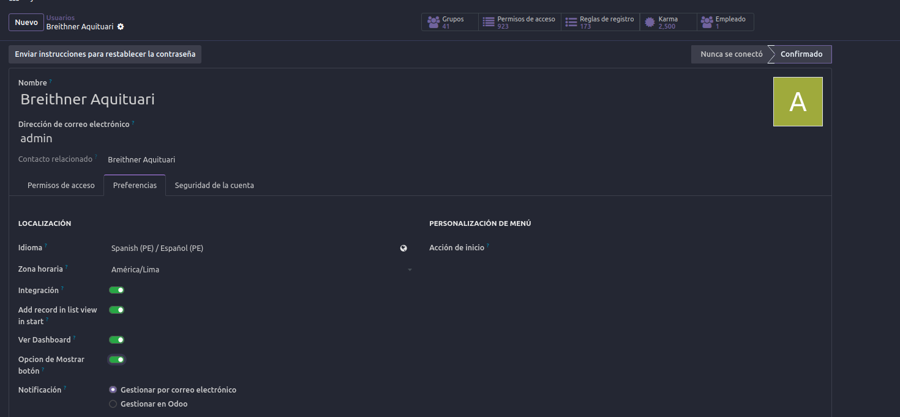
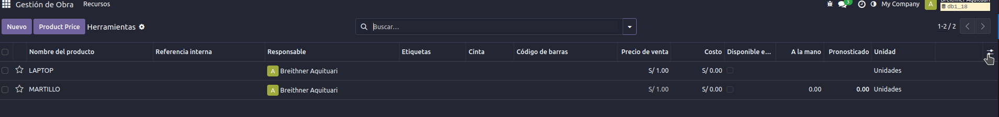
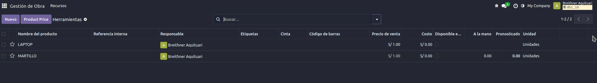

# option_list_show

Este módulo extiende la funcionalidad de Odoo 18 para **ocultar el botón que permite seleccionar columnas en vistas tipo lista** (list view), específicamente el botón ubicado al final de la cabecera de la tabla.

## 🧩 Funcionalidades

- Oculta el botón de selección de columnas por **usuario** (no por grupo).
- Basado en la clase `session_info` de `ir.http` para identificar el usuario conectado.
- Compatible con vistas `tree` (lista) estándar de Odoo.
- Mejora el control sobre la visibilidad de los campos, evitando que ciertos usuarios accedan a información que no deberían modificar o visualizar.

## 💡 Motivación

Este desarrollo surgió como respuesta a una necesidad planteada en un grupo de soporte técnico, donde varios usuarios requerían **restringir el acceso al botón de personalización de columnas** para evitar exposición de información sensible.

## 🔧 Instalación

1. Copia este módulo dentro de tu carpeta de addons.
2. Reinicia el servidor de Odoo.
3. Activa el modo desarrollador.
4. Instala el módulo desde el panel de Apps.

## ⚙️ Cómo funciona

El módulo **hereda el template del renderer de lista (`web.ListRenderer`)** y filtra, según el usuario, la visualización del botón final que despliega los campos configurables (`option="show"` / `option="hide"`).

## ✍️ Personalización

Si bien actualmente se basa en usuarios específicos, puedes adaptar fácilmente el código para usar grupos (`res.groups`) si necesitas una segmentación más flexible.

## 🤝 Contribución

Este módulo nace como una pequeña contribución a la comunidad Odoo, buscando dar soluciones reales a problemáticas frecuentes en la implementación del sistema.

## 📌 Requisitos

- Odoo 18
- Módulo base `web`

